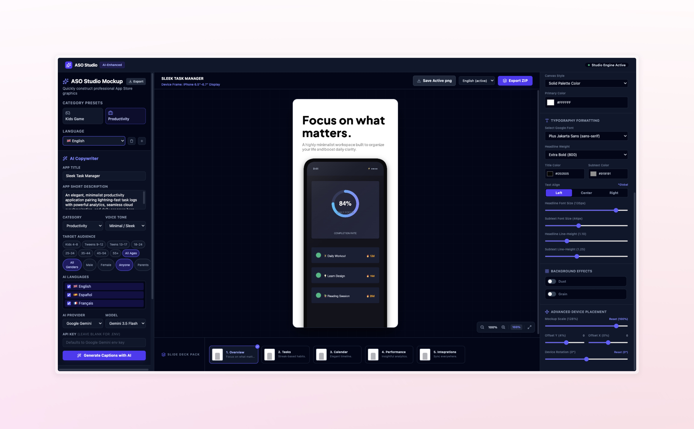

# ASO Studio — App Store Screenshot Generator

AI-powered tool to design, preview, and export high-resolution App Store and Google Play Store screenshots with AI-generated ASO-optimized copy.



## Features

- **AI Copywriter** — Generate persuasive screenshot captions via Gemini, OpenAI, Anthropic, or OpenRouter (multi-locale support with 22 languages)
- **Multi-device frames** — iPhone 6.5"/6.9", iPad Pro 12.9", Android phone (19.5:9)
- **Device bezels** — Dark, Light, Space Gray, Gold with rotation (-45° to +45°)
- **Visual customization** — Gradients, solid colors, radial blooms, opacity/scale/position sliders
- **Google Fonts** — 11 font presets with weight control and auto-loading
- **Overlay effects** — Dust particles, film grain
- **Background effects** — Drop-shadows and decorative overlays
- **Slide sequencer** — Add, reorder, duplicate, delete screens with drag-free controls
- **Multi-locale workflows** — Maintain translations across 22 locales, switch/export per language
- **Image upload** — Drag-and-drop or click-to-upload screenshots with cover/contain fitting
- **Export** — Download single PNGs or full slide decks as ZIP (per locale or all locales)
- **Session persistence** — Auto-saves to localStorage, restores on reload
- **Category presets** — Starter templates for Kids Games and Productivity apps
- **Settings export** — Download/upload project configuration as JSON

## Tech Stack

- **Frontend:** React 19, Vite, Tailwind CSS 4, Motion, Lucide React
- **Backend:** Express server with Vite dev middleware
- **Canvas rendering:** HTML5 Canvas for high-res output
- **AI:** @google/genai SDK, OpenAI/Anthropic/OpenRouter-compatible API
- **Packaging:** JSZip for ZIP export

## Setup

```bash
# Install dependencies
npm install

# Copy environment file
cp .env.example .env
```

Edit `.env` and set your API key for the AI provider you want to use:

```
GEMINI_API_KEY="your-gemini-api-key"
OPENAI_API_KEY="your-openai-api-key"
ANTHROPIC_API_KEY="your-anthropic-api-key"
OPENROUTER_API_KEY="your-openrouter-api-key"
```

## Development

```bash
npm run dev
```

Opens at `http://localhost:3000`.

## Production Build

```bash
npm run build
npm start
```

## Usage

1. Pick a category preset (Kids Game or Productivity) or add custom screens
2. Optionally describe your app in the AI Copywriter panel and generate captions
3. Customize each slide: upload screenshots, tweak colors, typography, device frame, and overlays
4. Export individual PNGs or download the full deck as ZIP
5. Switch languages to view/edit translations; export per-locale or all at once

## Project Structure

```
├── server.ts              # Express server + AI caption API
├── src/
│   ├── App.tsx            # Main app with state & locale management
│   ├── components/
│   │   ├── Sidebar.tsx    # AI panel, screen sequencer, locale switcher
│   │   ├── CanvasWorkspace.tsx  # Canvas preview, storyboard, export controls
│   │   └── CustomizePanel.tsx   # Per-slide styling controls
│   ├── utils/
│   │   └── canvasRenderer.ts    # Canvas rendering logic
│   ├── templates.ts       # Presets, device sizes, Google Fonts
│   └── types.ts           # TypeScript type definitions
├── index.html
├── vite.config.ts
├── tsconfig.json
└── LICENSE              # CC BY-NC 4.0
```

## Contributing

Contributions, issues, and forks are welcome! If you fork this project:

- Credit the original author — [Fujah Gabriel](https://github.com/fujahgabriel)
- Do not use this project for commercial purposes
- You may modify and distribute under the same license terms

## License

This project is licensed under the [Creative Commons Attribution-NonCommercial 4.0 International License](https://creativecommons.org/licenses/by-nc/4.0/) (CC BY-NC 4.0).

You are free to share and adapt the material for non-commercial purposes, provided you give appropriate credit to the original author. Commercial use is not permitted.

See the [LICENSE](./LICENSE) file for full details.
